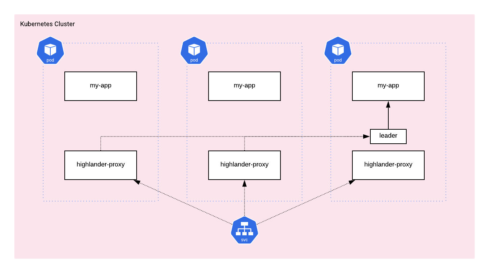

# highlander-proxy

highlander-proxy is a simple network proxy that encapsulates leadership election and forwarding semantics.

[](docs/assets/highlander-proxy.png)

## Status

This project currently offers `v1alpha1` support.
This includes:

* Preliminary functional support, not advised for production workloads
* Initial support for Kubernetes (future support for other platforms)

## Getting started on Kubernetes

Getting started on Kubernetes is trivial.
The co-process was written to integrate with the `Lease` API for leader election.

```yaml
    containers:
      - name:  leader
        image: mjpitz/highlander-proxy:latest
        imagePullPolicy: Always
        securityContext: {}
        env:
          - name: POD_IP
            valueFrom:
              fieldRef:
                apiVersion: v1
                fieldPath: status.podIP
          - name: NAMESPACE_NAME
            valueFrom:
              fieldRef:
                apiVersion: v1
                fieldPath: metadata.namespace
        args:
          - -bind-address
          - $(POD_IP):8080
          - -lock-namespace
          - $(NAMESPACE_NAME)
          - -lock-name
          - [lock_name]
          - -protocol
          - tcp
          - -remote-address
          - [process_address]
        ports:
          - containerPort: 8080
            name: tcp
```

In order to leverage this co-process, you will need to grant the process access to the `Lease` API.

```yaml
apiVersion: rbac.authorization.k8s.io/v1
kind: Role
metadata:
  name: [name]
rules:
- apiGroups: ['coordination.k8s.io']
  resources: ['leases']
  verbs:     ['*']
  resourceNames:
  - [lock_name]
```
